# NodeJs後台管理系統 全端項目

使用技術
### 前端

- 前端工程化環境(Webpack)
- CSS 預處理工具(sass)
- js模塊化：ES Module, CommonJS Module
- js庫： jQuery
- SPA：single page appication，路由：SME-Router
- UI組件庫：Bootstrap(AdminLTE)
- art-template
- ansi-html-community

### 後端

- nodejs
- express
- mongoose
- socket.io
- bcrypt
- cookie-parser
- cookie-session
- cors
- ejs
- jsonwebtoken
- mime
- moment

# 畫面及API展示

mongoDB數據庫

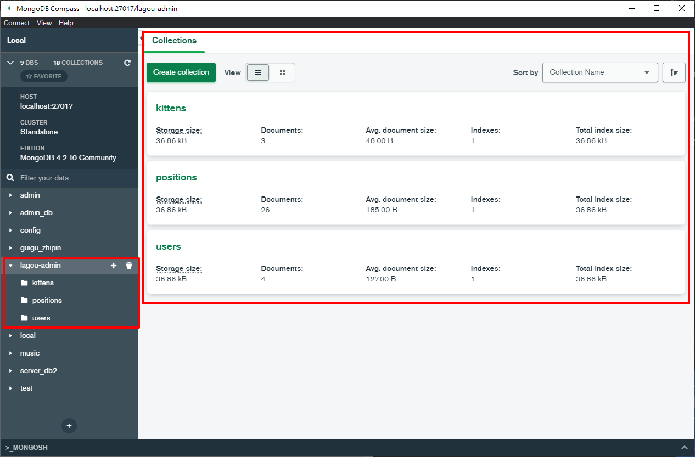

登入頁面-isAuth驗證中間件

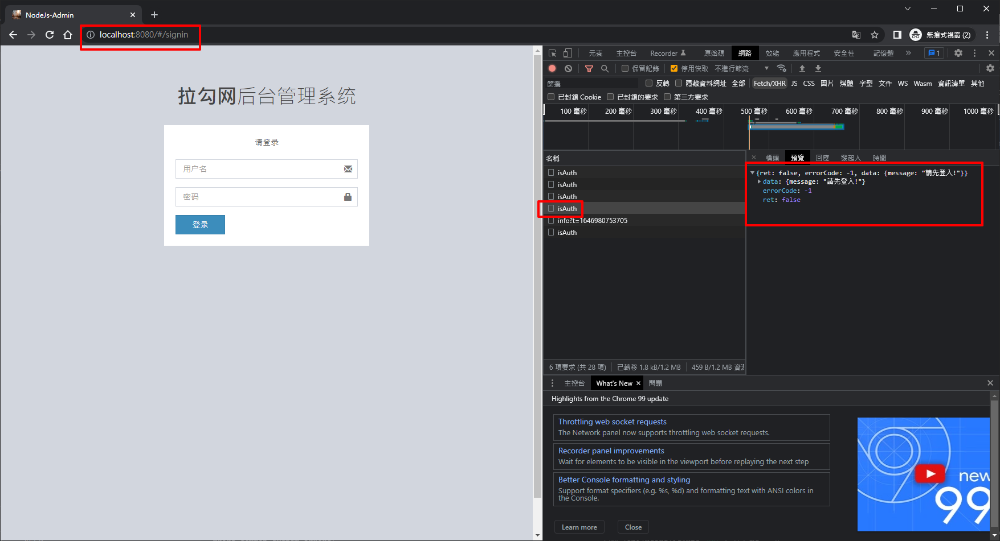

登入頁面-登入失敗

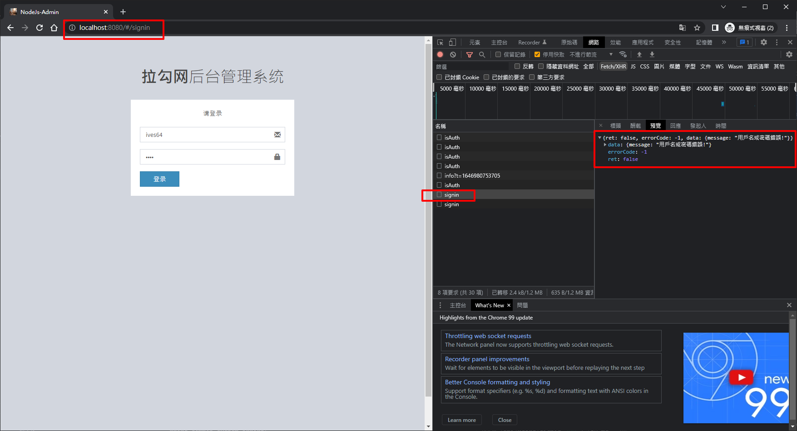

登入成功

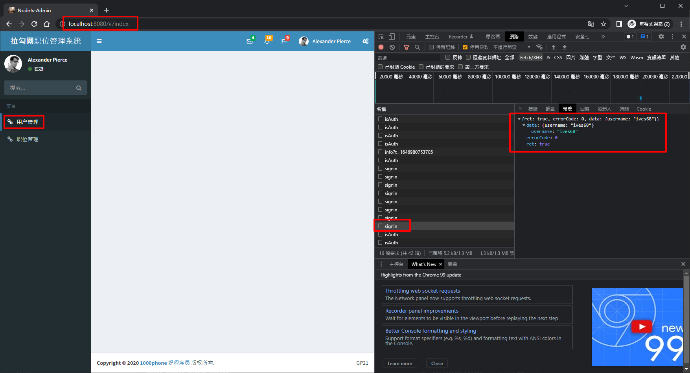

用戶管理-列表

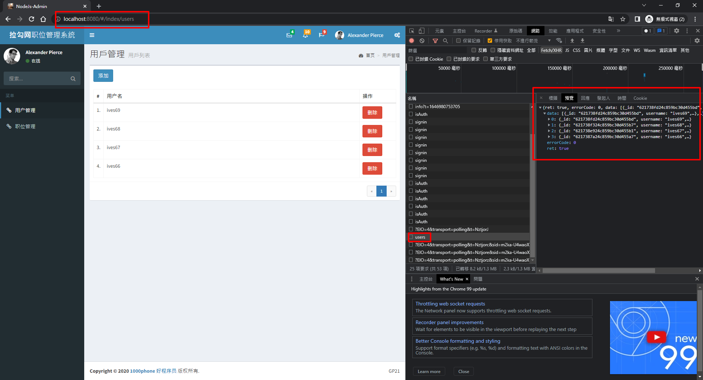

用戶管理-添加用戶

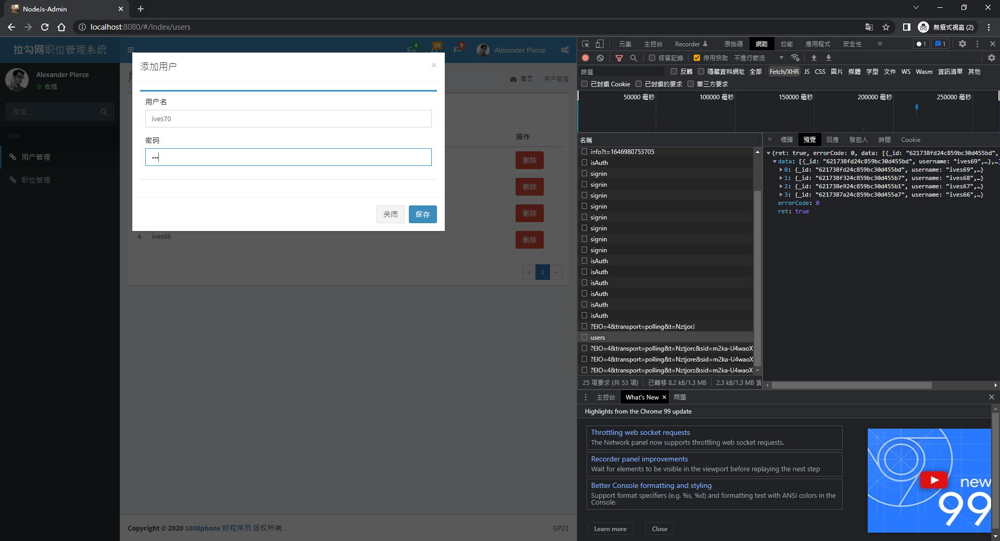

用戶管理-添加用戶-成功

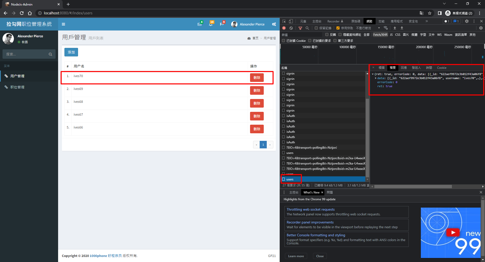

用戶管理-刪除用戶-成功

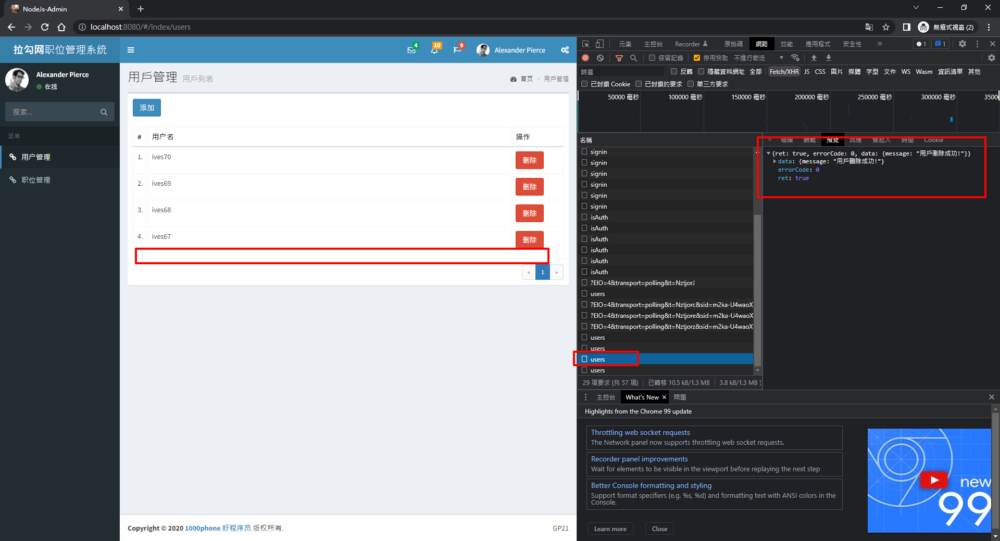

職位管理-列表

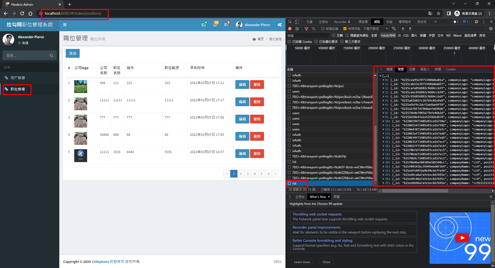

職位管理-編輯職位

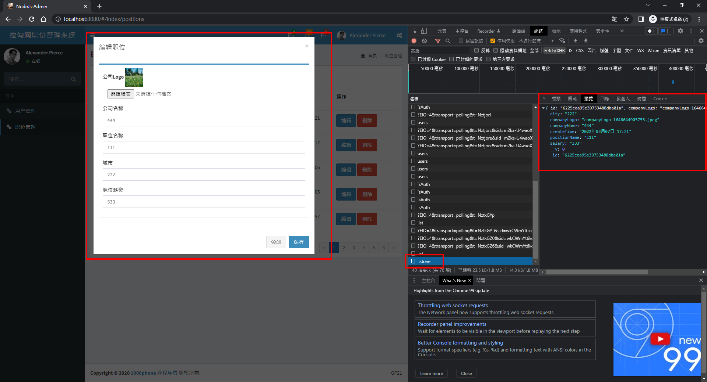

職位管理-編輯職位-成功

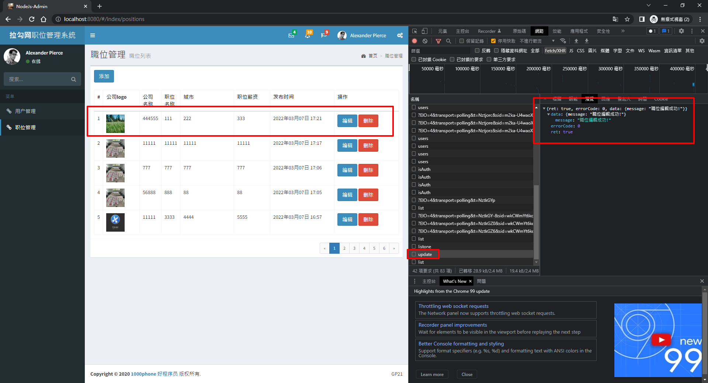

職位管理-刪除職位-成功

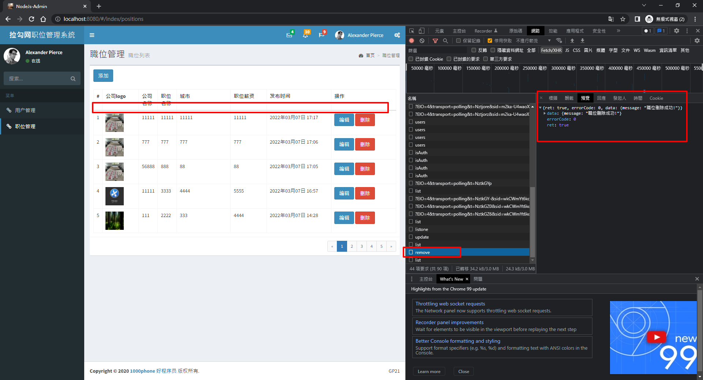

上方登出彈窗

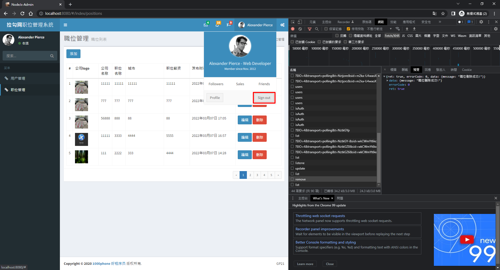

職位管理-添加職位

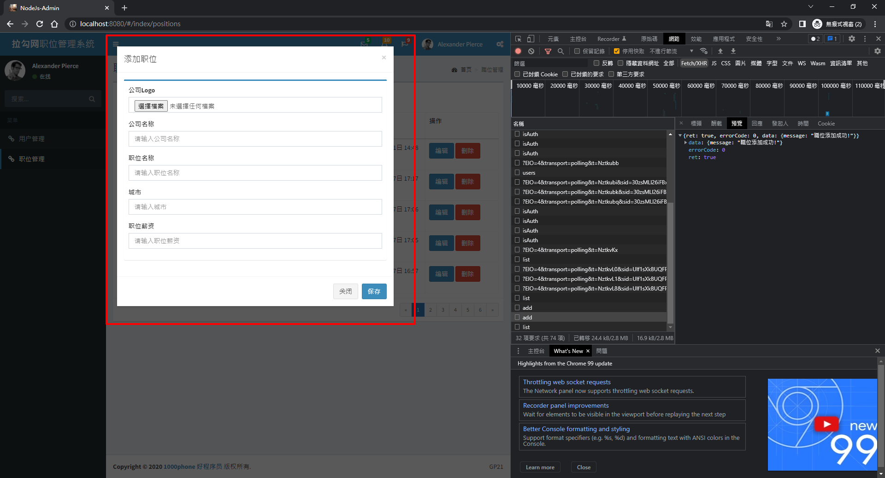

職位管理-添加職位-成功

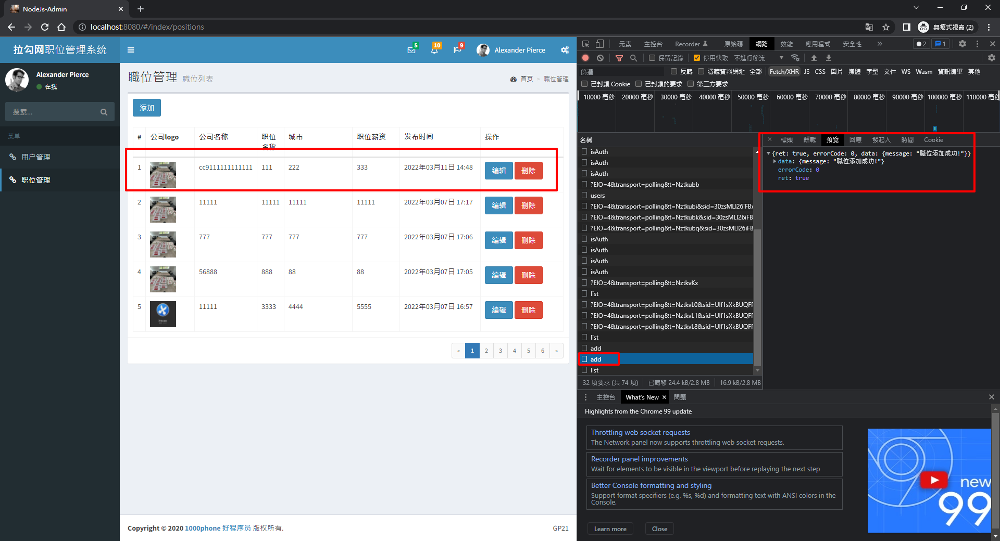


# Nodejs 筆記

# 01-safe-sandox

```html
<!DOCTYPE html>
<html lang="en">

<head>
  <meta charset="UTF-8">
  <meta http-equiv="X-UA-Compatible" content="IE=edge">
  <meta name="viewport" content="width=device-width, initial-scale=1.0">
  <title>browser-safe-sandbox</title>
</head>

<body>
  <div>browser-safe-sandbox</div>
  <script> 
    const xhr = new XMLHttpRequest()
    xhr.open('get', 'https://m.maoyan.com/ajax/moreClassicList?sortId=1&showType=3&limit=10&offset=30&optimus_uuid=A5518FF0AFEC11EAAB158D7AB0D05BBBD74C9789D9F649898982E6542C7DD479&optimus_risk_level=71&optimus_code=10', false) 
    xhr.send()
  </script>
</body>

</html>
```

運行網頁項目，開啟網頁服務器

```bash
npx http-server
```

# NVM

https://github.com/nvm-sh/nvm

# NVM for Windows

https://github.com/coreybutler/nvm-windows


# 查看包版本

```bash
npm view jquery versions
```

# 查看包依賴

```bash
npm list
```

加篩選條件

```bash
npm list | grep gulp
```

# 安裝

安裝開發依發

```
npm i XXX -D
```

安裝生產依發

```
npm i XXX -S
or
npm i XXX
```

# node pack versions
- 13.4.6
major: 13,minor:4, patch:6

- ^ -> 鎖定主版本號(major)
- ~ -> 鎖定主版本號、鎖定次版本號
- * -> 最新版本

# 清除npm緩存

```bath
npm cache clean --force
```

# npm

登入

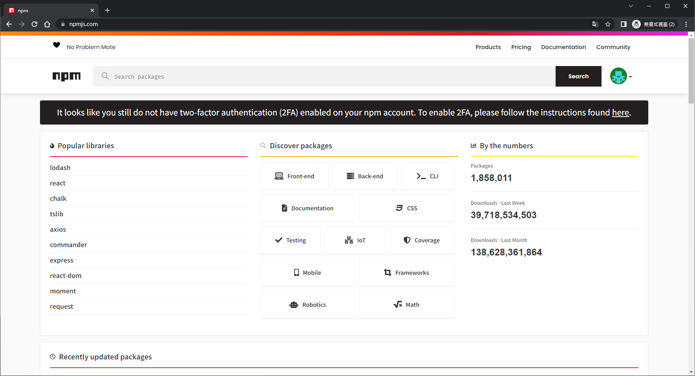

終端機登入

```bash
npm adduser
```

查看當前源

```bash
npm config get registry
```

切換淘寶源

```bash
npm config set registry https://registry.npm.taobao.org
```

切換npm官方源

```bash
npm config set registry https://registry.npmjs.org
```

上傳包

```bash
npm publish
```

上傳完成就可以正常安裝使用

```bash
npm i 03-custom 
```

```js
const myChunk = require('03-custom')

console.log("@@@03-custom",myChunk([3,4,7,9]))
```

# 取得package.json字段數扯

```js
console.log(process.env.npm_package_config_env)
```

```json
{
  "name": "02-npm",
  "version": "1.0.0",
  "description": "",
  "main": "01-require-jquery-global.js",
  "scripts": {
    "dev": "gulp -v",
    "greeting": "echo hello",
    "runjs": "node ./03-scripts/script1.js & node ./03-scripts/script2.js",
    "start": "node ./03-scripts/script.js",
    "test": "node ./03-scripts/test.js"
  },
  "author": "",
  "license": "ISC",
  "dependencies": {
    "03-custom": "^1.0.1",
    "axios": "^0.25.0",
    "jquery": "^2.2.4",
    "underscore": "^1.13.2"
  },
  "devDependencies": {
    "gulp": "^4.0.2"
  },
  "config": {
    "env": "production"
  }
}
```

# cross-env

```js
npm i cross-env -D
```

```js
"scripts": {
    "dev": "cross-env set NODE_ENV=development && gulp -f gulp.config.js",
    "prod": "cross-env set NODE_ENV=production && gulp -f gulp.config.js",
    "greeting": "echo hello",
    "runjs": "node ./03-scripts/script1.js & node ./03-scripts/script2.js",
    "start": "node ./03-scripts/script.js",
    "test": "node ./03-scripts/test.js",
    "build": "echo $npm_package_config_env"
  },
```

實際使用，會捉不到值

# NRM

切源工具
 
```bash
npm i nrm -g
```

# log4js

https://www.npmjs.com/search?q=log4js

```js
npm install log4js
```

# node的瀏覽端調試

--inspect

```js
 node --inspect server.js 
```

```js
 node --inspect --inspect-brk server.js 
```

# node進程管理工具

- supervisor
- nodemon
- forever
- pm2

```bash
npm i nodemon -g
```

# Insomnia

類似POSTMAN的功能

# 小米有品

https://www.xiaomiyoupin.com/

有API可用

https://insomnia.rest/download


# express 腳手架

https://www.expressjs.com.cn/starter/generator.html

生成項目

```bash
express -e
```

https://blog.csdn.net/sqrsdwq/article/details/107836079

# 唯品會

https://www.vip.com/

https://www.vip.com/nav/53174447.html

# 蝦皮

https://shopee.tw/api/v4/search/trending_search?bundle=popsearch&limit=8&offset=0


# http-proxy-middleware

```bash
npm i http-proxy-middleware
```

# 拉勾

https://m.lagou.com/

# cheerio

https://www.npmjs.com/package/cheerio

```bash
npm i cheerio
```

# 讀取文件/目錄信息

```js
function readDir(dir){
  fs.readdir(dir,(err,content)=>{
    content.forEach((value,index)=>{
      let joinDir = `${dir}/${value}`
      fs.stat(joinDir,(err,stats)=>{
        if(stats.isDirectory()){
          readDir(joinDir)
        }else{
          fs.readFile(joinDir,'utf-8',(err,content)=>{
            console.log(content)
          })
        }
      })
    })
  })
}

readDir('./')
```


# Mime

https://www.npmjs.com/package/mime

```bash
npm install mime
```

# Express

https://expressjs.com/zh-tw/

```bash
yarn init -y
yarn add express -S
```

查看express的所有版本

```bash
npm view express versions
```

# body-parser

```bash
npm install body-parser
yarn add body-parser
```

# express template

- ejs
- pug
- jade
- art-template

# art-template

https://aui.github.io/art-template/docs/

```bash
npm install --save art-template
npm install --save express-art-template
```

# MongoDB

```sql
db
show dbs
use music
db.dropDataBase

db.createCollection('jolin')
db.getCollectionNames()

db.jolin.insert([{name:'m1',release:'2022-01-01'}])

db.jolin.insertOne([{name:'m1',release:'2022-01-01'}])
db.jolin.find()
db.jolin.insertMany([{name:'m1 pro',release:'2022-01-01'},{name:'m1 max',release:'2022-02-01'}])

db.jolin.insert([{name:'m1',release:'2022-01-01'}])
db.jolin.insertOne({name:'m7',release:'2022-01-01'})

db.jolin.updateOne({name: 'm1'},{$set:{release:'2023-1-1'}})

db.jolin.updateOne({name:'m1'},{$inc: {publishNum:200}})


db.jolin.deleteOne({name: 'm1'})

db.jolin.remove({name:'m2'})

db.jolin.distinct("0")

db.jolin.find({release:{$gt:'2022-01-01'}})

db.jolin.find({release:{$gte:'2022-01-01'}})

db.jolin.find({release:{$lt:'2022-01-01'}})

db.jolin.find({release:{$lte:'2022-01-01'}})

db.jolin.find({release:{$gte:'2022-01-02',$lte:'2022-01-06'}})

db.jolin.find({name:/1$/})

db.jolin.find({},{_id:0,publishNum:0})

db.jolin.find({name:/1$/},{_id:0,publishNum:0})

db.jolin.find().sort({release:1})
db.jolin.find().sort({release:-1})

db.jolin.find().limit(3)
db.jolin.find().limit(3).skip(3)

db.jolin.find().sort({release:1}).limit(3).skip(6)
db.jolin.find().sort({release:-1}).limit(3).skip(6)

db.jolin.find({$or:[{release:'2022-01-01'},{release:'2022-03-04'}]})

db.jolin.find({$or:[{release:'2022-01-01'},{release:'2022-03-04'}]}).count()

db.jolin.findOne()
db.jolin.find().count()

```
# WebSocket

```bash
yarn add ws -S
```

# Node.js項目

## 前端(Frontend)

- 前端工程化環境(Webpack)
- CSS 預處理工具(sass)
- js模塊化：ES Module, CommonJS Module
- js庫： jQuery
- SPA：single page appication，路由：SME-Router
- UI組件庫：Bootstrap(AdminLTE)

## 後端(Backend)

- Node.js
- Express
- MongoDB(Mongoose)


# SEO 搜尋引擎優化

## 最基本條件

- 多頁面 => 蜘蛛抓取
- 頁面有蜘蛛抓取的內容
- title、描述、關鍵字

## 解決方案一：預渲染

vue插件：prerender-spa-plugin

解決title、描述、關鍵字 插件：vue-meta-info

缺點： 如果有很多詳情頁需要seo，預渲染就不適合了，動態去改變title、描述、關鍵字也是無效的
適合： 項目某幾個頁面作seo

```bash

npm i prerender-spa-plugin -D
npm i vue-meta-info -D
```


```js
new PrerenderSPAPlugin({
          staticDir: path.join(__dirname, 'dist'),
          routes: ['/', '/about', '/admin/addProduct'],
          minify: {
            collapseBooleanAttributes: true,
            collapseWhitespace: true,
            decodeEntities: true,
            keepClosingSlash: true,
            sortAttributes: true,
          },
          renderer: new Renderer({
            renderAfterDocumentEvent: 'render-event',
            headless: false,
          }),
        })
```


## 解決方案二：服務端渲染

Nuxt.js 項目上線流程

1. npm run build
2. 將打包完成的文件單獨拷貝出來
  - nuxt.config
  - .nuxt
  - package.json
  - static
3. 將4個文件拷貝到服務器上，服務器安裝node環境  
```bash
npm i
npm run start
```

4. nginx 設置代理

# AdminLTE

起始示範頁面

https://adminlte.io/themes/v3/starter.html

https://adminlte.io/docs/3.1//layout.html

https://adminlte.io/themes/v3/

# SME-Router

https://github.com/SME-FE/sme-router

https://sme-fe.github.io/website-router/zh/

```bash
npm i --save sme-router
```

# Express

https://expressjs.com/zh-tw/starter/generator.html

```bash
yarn global add express-generator
```

```bash
express -e
```

# mongoose

https://mongoosejs.com/

http://www.mongoosejs.net/

```bash
npm install mongoose
```

```bash
use lagou-admin
db.getCollectionNames()
db.kittens.find()
```

# bcrypt

https://www.npmjs.com/package/bcrypt

```bash
yarn add bcrypt
```

```js
bcrypt.hash(myPlaintextPassword, saltRounds, function(err, hash) {
    // Store hash in your password DB.
});
```

# cors

https://www.npmjs.com/package/cors

```bash
npm install cors
```

# 配置代理

https://v4.webpack.js.org/configuration/dev-server/#devserverproxy


```js
module.exports = {
  //...
  devServer: {
    proxy: {
      '/api': {
        target: 'http://localhost:3000',
        // pathRewrite: {'^/api' : ''}
      }
    }
  }
};
```

# randomstring

https://www.npmjs.com/package/randomstring

```bash
npm install randomstring
```

```js
randomstring.generate();
```

# set-Cookie

https://expressjs.com/zh-tw/4x/api.html#res

```js
res.append('Set-Cookie', 'foo=bar; Path=/; HttpOnly')
```

# cookie-session

https://www.npmjs.com/package/cookie-session

```bash
npm install cookie-session
```

# jsonwebtoken

https://www.npmjs.com/package/jsonwebtoken

```bash
npm install jsonwebtoken
```

# gp21-router

```bash
npm i gp21-router -S
```
# url-loader
```bash
npm i url-loader -D
```

# Moment.js

https://www.npmjs.com/package/moment

```bash
npm i moment
```

# Multer

https://www.npmjs.com/package/multer

```bash
npm i multer
```

# Mime

https://www.npmjs.com/package/mime

```bash
npm i mime
```

# socket.io

```bash
npm i socket.io
```

# Koa

https://koajs.com/#

http://koajs.cn/

https://github.com/koajs/koa

```bash
yarn init -y
yarn add koa
```

```bash
yarn add @koa/router

```

# koa-bodyparser

https://www.npmjs.com/package/koa-bodyparser

# koa-static

https://www.npmjs.com/package/koa-static

```bash
npm install koa-static
```

# koa-views

https://www.npmjs.com/package/koa-views

```bash
npm install koa-views
```

# ejs

```bash
npm i ejs
```

# mysql

https://www.npmjs.com/package/mysql

```bash
npm i mysql
```

# koa-session-minimal

https://www.npmjs.com/package/koa-session-minimal

```bash
npm install koa-session-minimal
```

# koa-mysql-session

https://www.npmjs.com/package/koa-mysql-session


```bash
npm install koa-mysql-session
```

# jsonwebtoken

https://www.npmjs.com/package/jsonwebtoken

```bash

npm install jsonwebtoken
```


產生token

```js
const token = (req, res, next) => {
  const tk = jwt.sign({ username: 'admin' }, 'hahaha')
  res.send(tk)
}
```

驗證token

https://jwt.io/

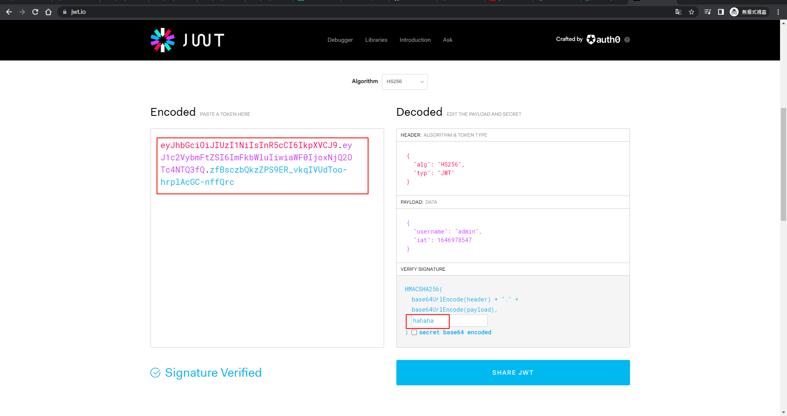

# openssl

> openssl

生成私鑰

openssl > genrsa -out rsa_private_key.pem 2048

```bash
openssl
genrsa -out rsa_private_key.pem 2048
```


根據私鑰生成公鑰

openssl > rsa -in rsa_private_key.pem -pubout -out rsa_public_key.pem

```bash
openssl
rsa -in rsa_private_key.pem -pubout -out rsa_public_key.pem
```